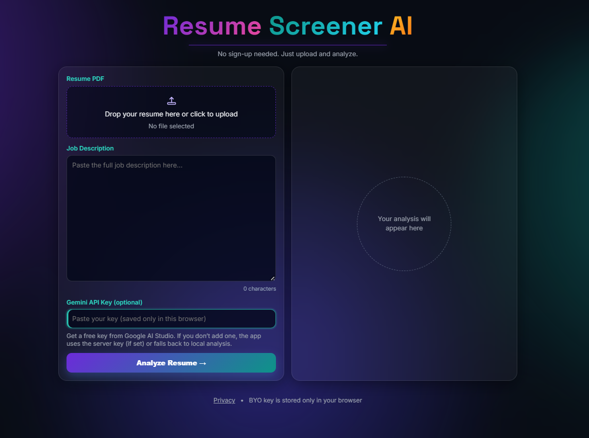

# AI Resume Screener (Gemini + Evidence)

An AI-powered resume screening web app that compares a **resume PDF** against a **job description** and returns a fit score, skill gaps, and concrete improvement suggestions — with an optional **evidence** section for transparency.



Built for real-world demo/public usage:
- **Graceful under load:** async jobs + polling (no long request timeouts)
- **Doesn’t “break” on quota:** local fallback analysis when Gemini rate-limits/unavailable
- **BYO API key:** users can paste their own Gemini key to avoid shared-quota limits
- **Privacy-first:** common PII is redacted before sending text to the LLM

**Live demo:** https://huggingface.co/spaces/Afrin18/ai-resume-screener

---

## What it does

Given:
- a resume PDF (`.pdf`)
- a job description (text)

It returns:
- **Score (0–100)** (semantic similarity + keyword coverage)
- **Verdict** (Strong / Good / Partial / Weak Fit)
- **Matching skills** and **missing skills**
- **Suggestions** (3–5)
- **Recruiter summary**
- **Evidence** (when LLM is available): requirement → resume proof → confidence

---

## How it works (high level)

1) Extract text from the PDF (PyMuPDF)
2) Compute a local score using embeddings + keyword coverage
3) Redact common PII (email / phone / URLs) before sending text to the LLM
4) Ask Gemini for a strict JSON analysis (skills, suggestions, evidence)
5) If Gemini is rate-limited/unavailable → return a local heuristic analysis instead

---

## Deploy on Hugging Face Spaces (Docker)

### 1) Create the Space

- Create a new Space
- Choose **SDK: Docker**
- Make it Public (if you want everyone to use it)

### 2) Push code to the Space

Either:
- Push this repo to the Space git remote, or
- Connect the Space to your GitHub repo

### 3) Add Secrets / Variables

Space → Settings → Variables and secrets:

**Recommended:**
- `GEMINI_API_KEY` (server-side key)

**Optional (recommended for higher traffic / reliability):**
- `REDIS_URL` (e.g., Upstash Redis) — enables Redis-backed queue + shared rate limiting

### 4) Build + open

Once the build finishes, open the Space URL.

Notes:
- The Docker build pre-downloads the embedding model so runtime requests don’t depend on Hugging Face downloads.

---

## Configure Gemini (two modes)

### Option A — Server key

Set `GEMINI_API_KEY` as a HF Space secret (recommended). The app will use it automatically.

### Option B — BYO key (recommended for public demos)

Users can paste their own Gemini API key in the UI.
- Stored only in their browser (localStorage)
- Sent per request as `X-Gemini-Api-Key`

This prevents one shared key from hitting quota when many users try the app.

---

## Local development

See `ai-resume-screener/README.md` for the full local setup instructions.

---

## API (async)

### `POST /analyze`

- Content-Type: `multipart/form-data`
- Fields:
  - `job_description` (text)
  - `resume` (PDF)
- Optional:
  - Header `X-Gemini-Api-Key` (BYO)
- Response: `202` with `{ "job_id": "...", "status": "processing" }`

### `GET /result/<job_id>`

- `{"status":"processing"}`
- `{"status":"done", ...results}`
- `{"status":"error","error":"..."}`

---

## Privacy

- Common PII is redacted before sending text to Gemini.
- Uploaded PDFs are stored temporarily for processing, then deleted.
- See the in-app privacy page at `/privacy`.

---

## Repo structure

```
.
├─ Dockerfile
├─ .dockerignore
└─ ai-resume-screener/
   ├─ app.py
   ├─ queue_worker.py
   ├─ requirements.txt
   ├─ .env.example
   └─ templates/
      ├─ index.html
      └─ privacy.html
```

---

## Troubleshooting

- **429 Too Many Requests:** Gemini rate limit/quota. Wait a bit, or use BYO key in the UI.
- **Results “expire”:** job results are kept for a limited time (to keep memory/Redis usage bounded).
- **Scanned/image resume PDFs:** text extraction may fail. Use a text-based PDF (or convert with OCR).

